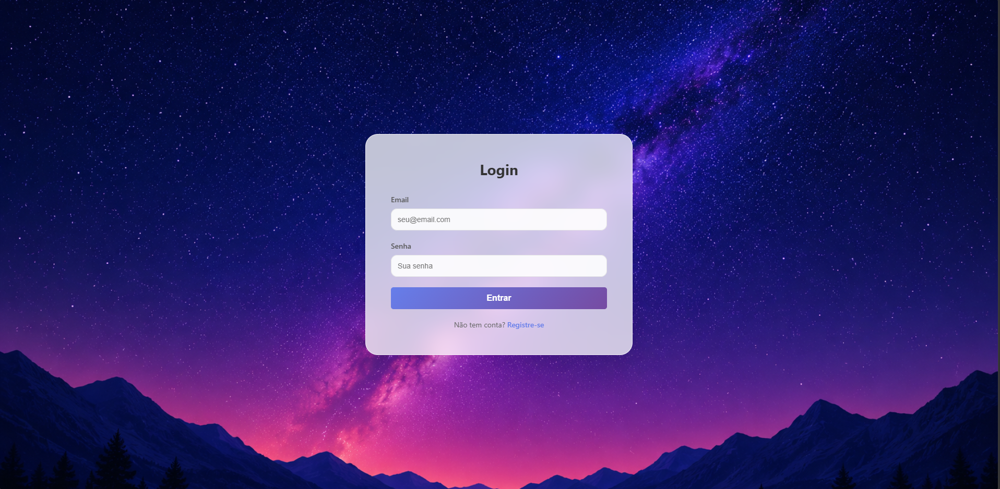
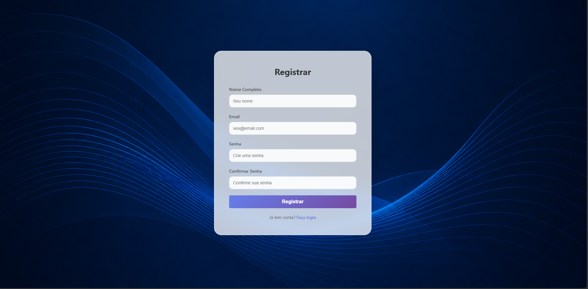
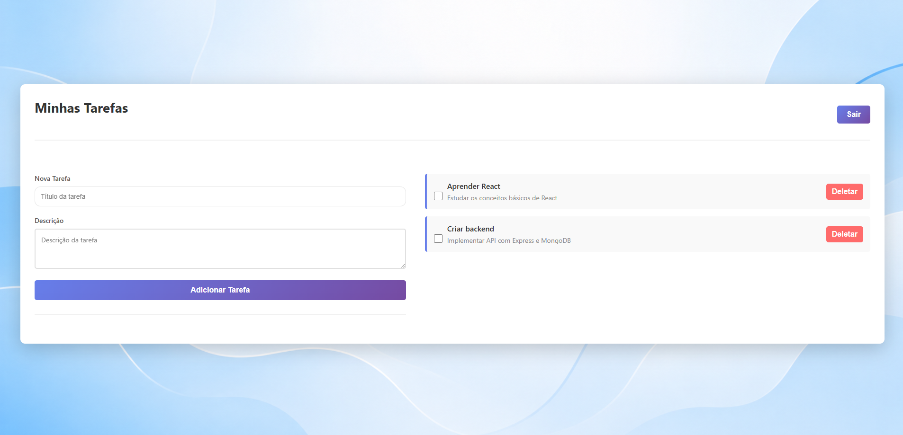

# TaskFlow — Fullstack Task Management System

TaskFlow is a fullstack task management application built to practice real-world web development concepts using a modern JavaScript stack.

The application allows users to register, authenticate securely using JWT, and manage personal tasks with full CRUD operations.

---

# 🚀 Features

* User registration and login
* JWT authentication
* Protected routes
* Create tasks
* Edit tasks
* Delete tasks
* Mark tasks as completed
* Personal task management
* Responsive interface

---

# 🛠️ Technologies Used

## Frontend

* React
* Axios
* React Router DOM
* Tailwind CSS / CSS
* Vite

## Backend

* Node.js
* Express.js
* MongoDB
* Mongoose
* JWT
* bcryptjs
* dotenv
* cors

---

# 📁 Project Structure

## Backend

```bash
src/
 controllers/
 middleware/
 models/
 routes/
```

## Frontend

```bash
src/
 components/
 pages/
 services/
```

---

# ⚙️ Installation

## Clone repository

```bash
git clone https://github.com/YOUR_USERNAME/taskflow.git
```

---

# 🔧 Backend Setup

Enter backend folder:

```bash
cd backend
```

Install dependencies:

```bash
npm install
```

Create a `.env` file:

```env
MONGO_URI=your_mongodb_connection
JWT_SECRET=your_secret_key
PORT=5000
```

Run server:

```bash
npm run dev
```

---

# 💻 Frontend Setup

Enter frontend folder:

```bash
cd frontend
```

Install dependencies:

```bash
npm install
```

Create a `.env` file:

```env
VITE_API_BASE_URL=http://localhost:5000/api
```

Run frontend:

```bash
npm run dev
```

---

# 🌐 Deployment

## Frontend

Deployed on Vercel.

## Backend

Deployed on Render.

## Database

Hosted on MongoDB Atlas.

---

# 🔒 Authentication

This project uses:

* JWT Authentication
* Password hashing with bcryptjs
* Protected API routes

---

# 📸 Screenshots

## Login Page


---

## Register Page


---

## Task Management


---

# 🎯 Purpose

This project was created as a portfolio project to improve fullstack development skills and simulate a real-world junior fullstack developer application.

---

# 📄 License

This project is open source and available for learning purposes.
